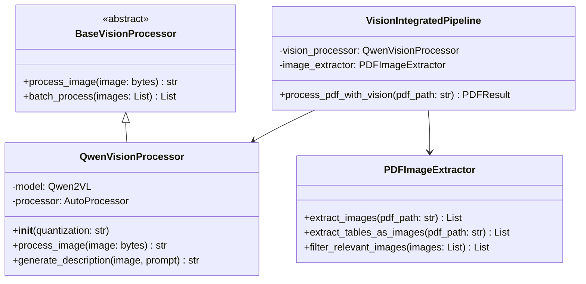

# Qwen2.5-VL-7B Vision Model Integration Plan

## 개요
PDF 문서의 이미지, 차트, 테이블 등 시각적 요소를 텍스트로 변환하여 RAG 시스템의 검색 성능을 향상시키기 위한 Vision-Language 모델 통합 계획

## 1. 목표 및 범위

### 주요 목표
- PDF 내 이미지를 의미있는 텍스트 설명으로 변환
- 차트, 그래프, 다이어그램의 정보 추출
- 테이블 스크린샷의 구조화된 정보 추출
- 금융 문서 특화 프롬프트 엔지니어링

### 적용 범위
- **사전 처리 단계**: 지식베이스 구축 시에만 Vision 모델 사용
- **추론 단계**: Vision 모델 불필요 (사전 구축된 인덱스만 사용)
- **대상 문서**: 금융 보안 가이드라인, 규제 문서, 기술 문서

## 2. 기술 스택

### 핵심 모델
```python
Model: Qwen/Qwen2.5-VL-7B-Instruct
- 크기: 14GB (FP16) / 7GB (INT8) / 3.5GB (INT4)
- 능력: 이미지 이해, OCR, 차트 해석, 한국어 지원
- 라이선스: Apache 2.0 (상업적 사용 가능)
```

### 의존성
```python
transformers>=4.45.0  # Qwen2-VL 지원
torch>=2.0.0
pillow>=10.0.0
pymupdf>=1.24.0
accelerate>=0.30.0
bitsandbytes>=0.43.0  # 양자화
```

## 3. 아키텍처 설계

### 3.1 디렉토리 구조
```
packages/
├── vision/
│   ├── __init__.py
│   ├── base_processor.py       # 추상 베이스 클래스
│   ├── qwen_vision.py          # Qwen2.5-VL 구현
│   ├── image_extractor.py      # PDF 이미지 추출
│   ├── vision_pipeline.py      # 통합 파이프라인
│   └── prompts/
│       ├── __init__.py
│       ├── financial.py        # 금융 문서 프롬프트
│       └── korean.py           # 한국어 특화 프롬프트
├── preprocessing/
│   └── pdf_processor.py        # 기존 PDF 프로세서 확장
└── rag/
    └── knowledge_base.py       # Vision 통합 지식베이스
```

### 3.2 클래스 다이어그램


## 4. 구현 계획

### Phase 1: 기반 구조 (Day 1)
- [ ] Vision 모듈 디렉토리 구조 생성
- [ ] BaseVisionProcessor 추상 클래스 정의
- [ ] 설정 관리 클래스 구현

### Phase 2: Qwen2.5-VL 통합 (Day 2-3)
- [ ] QwenVisionProcessor 구현
- [ ] 4-bit 양자화 설정
- [ ] 배치 처리 최적화
- [ ] 에러 핸들링 및 폴백 메커니즘

### Phase 3: PDF 이미지 처리 (Day 4-5)
- [ ] PDFImageExtractor 구현
- [ ] 이미지 필터링 로직 (로고, 아이콘 제외)
- [ ] 테이블 영역 이미지 렌더링
- [ ] 메타데이터 보존

### Phase 4: 프롬프트 엔지니어링 (Day 6)
- [ ] 금융 문서 특화 프롬프트 템플릿
- [ ] 차트/그래프 설명 프롬프트
- [ ] 테이블 구조 추출 프롬프트
- [ ] 한국어 최적화

### Phase 5: 통합 및 테스트 (Day 7-8)
- [ ] VisionIntegratedPipeline 구현
- [ ] 기존 RAG 파이프라인과 통합
- [ ] 단위 테스트 작성
- [ ] 통합 테스트 수행

### Phase 6: 최적화 (Day 9-10)
- [ ] 성능 프로파일링
- [ ] 메모리 사용량 최적화
- [ ] 처리 속도 개선
- [ ] 캐싱 메커니즘 구현

## 5. 핵심 구현 코드

### 5.1 QwenVisionProcessor 핵심 메서드
```python
class QwenVisionProcessor(BaseVisionProcessor):
    def __init__(self, model_id="Qwen/Qwen2.5-VL-7B-Instruct", quantization="4bit"):
        self.device = "cuda" if torch.cuda.is_available() else "cpu"
        
        # 4-bit 양자화 설정
        if quantization == "4bit":
            quantization_config = BitsAndBytesConfig(
                load_in_4bit=True,
                bnb_4bit_compute_dtype=torch.float16,
                bnb_4bit_quant_type="nf4"
            )
            self.model = Qwen2VLForConditionalGeneration.from_pretrained(
                model_id,
                quantization_config=quantization_config,
                device_map="auto"
            )
        else:
            self.model = Qwen2VLForConditionalGeneration.from_pretrained(
                model_id,
                torch_dtype=torch.float16,
                device_map="auto"
            )
        
        self.processor = AutoProcessor.from_pretrained(model_id)
    
    def process_image(self, image_bytes: bytes, context: str = "") -> str:
        """이미지를 텍스트 설명으로 변환"""
        image = Image.open(io.BytesIO(image_bytes))
        
        # 금융 문서 특화 프롬프트
        prompt = self._create_prompt(context)
        
        messages = [
            {
                "role": "user",
                "content": [
                    {"type": "image", "image": image},
                    {"type": "text", "text": prompt}
                ]
            }
        ]
        
        # 토크나이즈 및 추론
        text = self.processor.apply_chat_template(messages, tokenize=False)
        inputs = self.processor(text, images=image, return_tensors="pt").to(self.device)
        
        with torch.no_grad():
            outputs = self.model.generate(
                **inputs,
                max_new_tokens=512,
                temperature=0.3,
                do_sample=True
            )
        
        description = self.processor.decode(outputs[0], skip_special_tokens=True)
        return self._postprocess_description(description)
```

### 5.2 지식베이스 구축 스크립트
```python
class VisionEnhancedKnowledgeBuilder:
    def build_with_vision(self, pdf_dir: Path, output_dir: Path):
        """Vision 모델을 활용한 지식베이스 구축"""
        
        # Vision 프로세서 초기화
        vision_processor = QwenVisionProcessor(quantization="4bit")
        image_extractor = PDFImageExtractor()
        
        all_chunks = []
        
        for pdf_file in pdf_dir.glob("*.pdf"):
            print(f"처리 중: {pdf_file.name}")
            
            # 1. 텍스트 추출
            text_content = extract_text(pdf_file)
            
            # 2. 이미지 추출 및 설명 생성
            images = image_extractor.extract_images(pdf_file)
            for img_data in images:
                if self._is_relevant_image(img_data):
                    description = vision_processor.process_image(
                        img_data['bytes'],
                        context=img_data['page_context']
                    )
                    # 텍스트에 이미지 설명 통합
                    text_content += f"\n[이미지: {description}]\n"
            
            # 3. 청킹
            chunks = self.chunker.chunk(text_content)
            all_chunks.extend(chunks)
        
        # 4. 임베딩 및 인덱싱
        embeddings = self.embedder.embed_batch([c['text'] for c in all_chunks])
        index = self.build_faiss_index(embeddings)
        
        # 5. 저장
        self.save_knowledge_base(index, all_chunks, output_dir)
```

## 6. 성능 목표

### 처리 시간
- 이미지당 처리: 1-2초 (4-bit 양자화)
- PDF당 처리: 5-10분 (50페이지 기준)
- 전체 지식베이스 구축: 2-4시간

### 메모리 사용량
- Vision 모델: 3.5GB (4-bit)
- 피크 사용량: 8GB 이하
- 추론 시: 0GB (Vision 모델 불필요)

### 품질 지표
- 이미지 설명 정확도: 85% 이상
- 차트 정보 추출률: 80% 이상
- 테이블 구조 보존율: 90% 이상

## 7. 리스크 및 대응 방안

### 리스크 1: 메모리 부족
- **대응**: 4-bit 양자화, 배치 크기 조정, CPU 오프로딩

### 리스크 2: 처리 시간 초과
- **대응**: 선택적 이미지 처리, 병렬 처리, 캐싱

### 리스크 3: 모델 다운로드 실패
- **대응**: 로컬 모델 캐시, 대체 모델 준비

## 8. 테스트 계획

### 단위 테스트
- [ ] Vision 프로세서 초기화 테스트
- [ ] 이미지 처리 정확도 테스트
- [ ] 에러 핸들링 테스트

### 통합 테스트
- [ ] PDF 처리 엔드투엔드 테스트
- [ ] RAG 파이프라인 통합 테스트
- [ ] 성능 벤치마크 테스트

### 검증 기준
- [ ] 금융 문서 10개 처리 성공
- [ ] 검색 정확도 5% 향상
- [ ] 메모리 사용량 8GB 이하

## 9. 일정

| 날짜 | 작업 내용 | 완료 기준 |
|------|-----------|-----------|
| Day 1 | 기반 구조 설정 | 디렉토리 구조, 베이스 클래스 |
| Day 2-3 | Qwen2.5-VL 통합 | 모델 로드, 추론 성공 |
| Day 4-5 | PDF 이미지 처리 | 이미지 추출, 필터링 |
| Day 6 | 프롬프트 최적화 | 금융 문서 특화 프롬프트 |
| Day 7-8 | 통합 테스트 | E2E 파이프라인 동작 |
| Day 9-10 | 최적화 및 문서화 | 성능 목표 달성 |

## 10. 다음 단계

1. **즉시 시작**: Vision 모듈 디렉토리 생성
2. **모델 다운로드**: Qwen2.5-VL-7B-Instruct 사전 다운로드
3. **테스트 데이터 준비**: 이미지가 포함된 PDF 샘플 수집
4. **프로토타입 구현**: 단일 이미지 처리 테스트